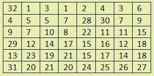
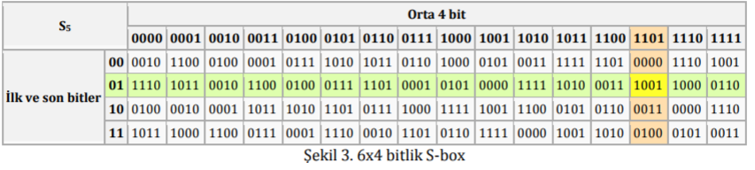

# ***BİLGİSAYAR SİSTEMLERİ LAB.***
- Deney: LİNEER KRİPTO ANALİZ
- 15260038 Furkan Ali Ünal

Sorular:
- [*Transform fonksiyonu ne işe yarar?*](#soru-1-transform-fonksiyonu-ne-i%C5%9Fe-yarar)
- [*PC-1 Fonksiyonu ne işe yarar?*](#soru-2-pc-1-fonksiyonu-ne-i%C5%9Fe-yarar)
- [*S-Box fonksiyonu ne işe yarar?*](#soru-3-s-box-fonksiyonu-ne-i%C5%9Fe-yarar)
- [*PlainText 1 bitlerinden oluşan bir girdide anahtar 0 bitleri girilir ise ilk roundun çıktısı ne olur?*](#soru-4-plaintext-1-bitlerinden-olu%C5%9Fan-bir-girdide-anahtar-0-bitleri-girilir-ise-ilk-roundun-%C3%A7%C4%B1kt%C4%B1s%C4%B1-ne-olur)

 
 
 

## Soru 1: Transform fonksiyonu ne işe yarar? 
- 56 bitlik anahtarın her roundda 2 ye bölünmesi ve iki parçanın da shift edilerek birleştirilmesi ve yeni bir anahtar oluşturulması da transform işlemidir

 
 
 

## Soru 2: Pc-1 fonksiyonu ne işe yarar?
- Transform edilen anahtarların birleştirildiği, şifrelendiği yerdir

 
 
 

## Soru 3: S-Box fonksiyonu ne işe yarar?
- Önceki aşamada XOR işlemi uygulanan 48 bit in, 8 parçaya bölünmesi S1-S8 S-Box çıkışlarında bu 6 bitlik verilerin 4 bitlik hale çevirilmesidir.

 
 
 

## Soru 4: PlainText 1 bitlerinden oluşan bir girdide anahtar 0 bitleri girilir ise ilk roundun çıktısı ne olur?
 

*Plain Text: 11111111 11111111 11111111 11111111 11111111 11111111 11111111 11111111 (64x 1 biti)*

*Key: 00000000 00000000 00000000 00000000 00000000 00000000 00000000 00000000 (64x 0 biti)*

    Plain text parçalanır:
        L bit: 11111111 11111111 11111111 11111111 (İlk 32 bit)
        R bit: 11111111 11111111 11111111 11111111 (Son 32 bit)

R bit f fonksiyonuna sokulur...

Öncelikle X-OR işlemine tabi tutulacak anahtar hazırlanır
                    
                    
0  0  0  0  0  0  0  0 
0  0  0  0  0  0  0  0 
0  0  0  0  0  0  0  0 
0  0  0  0  0  0  0  0 
0  0  0  0  0  0  0  0 
0  0  0  0  0  0  0  0 

Parity bitler atılır

    Parity bit verinin aktarım sırasında kayba uğramadığını test etmek için kullanılan 1 bitlerini çift sayıya ulaştıracak kontrol bitidir

Sonucunda 56 bitlik anahtar elde edilir. Bu 56 bitlik anahtar 28, 28 bitlik iki parçaya ayrılır

PC1 de elimizdeki parçalar birleştirilir = 56 Adet 0 bitidir
ancak yanlardaki 4' er bitler ignore edilir ve 48 bit elde edilir

R bitimiz 32 bitten oluşuyor. Bu bitler expand işlemine alınarak 48 bit haline getirilecektir

Örnek olarak bu tablo kullanılacaktır

Bu tabloya göre expand işlemi sonucu bitlerimiz yine 0 lardan oluşur ancak artık 48 adettir.

Artık X-OR işlemine başlayabiliriz

R bit: 000000 000000 000000 000000 000000 000000 000000 000000 
PC-1:  111111 111111 111111 111111 111111 111111 111111 111111

48 Bitlik Sonuç: 111111 111111 111111 111111 111111 111111 111111 111111

Şimdi son olarak bu sonuç S-Box yardımı ile 32 bite çevirilecektir

S-Box Tablosu

Sonuç: 0011 0011 0011 0011 0011 0011 0011 0011

Şeklinde 32 bit haline getirilir ve L bit ile birleştirilir

Şifrelenmiş mesaj: 00110011 00110011 00110011 00110011 11111111 11111111 11111111 11111111